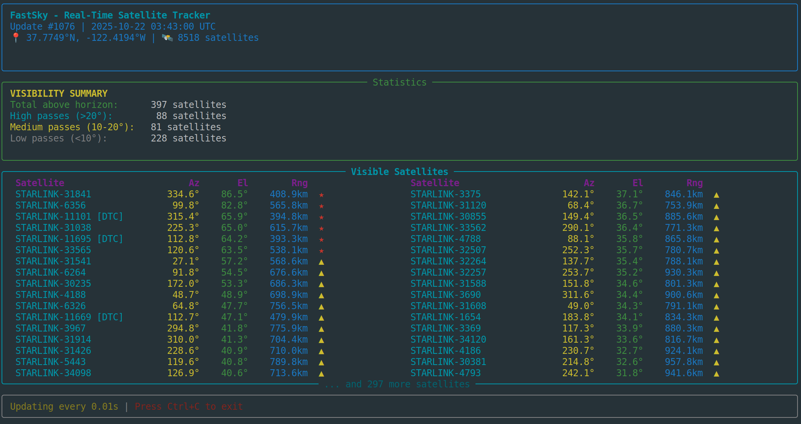

# FastSky - GPU-Accelerated Real-Time Satellite Tracker



Real-time satellite tracking using dsgp4 with CUDA GPU batch propagation. Processes 1M+ satellites/second on RTX 4090 at 100 Hz refresh rate.

## Quick Start

```bash
make install
make run
```

Press **Ctrl+C** to exit.

## Features

- **GPU Batch Processing**: 8,518 satellites in one batch call
- **~1,000,000 satellites/second** 
- **100 Hz updates**: Real-time tracking
- **Multi-column display**: Shows 100 satellites simultaneously

## Requirements

- Python 3.9+
- NVIDIA GPU with CUDA (optional but recommended)
- Poetry for dependency management

## Custom Location

```bash
poetry run python sattrack.py --lat 40.7128 --lon -74.0060  # New York
poetry run python sattrack.py --lat 51.5074 --lon -0.1278   # London
```

## TLE Data

Download fresh TLE data:
```bash
wget https://celestrak.org/NORAD/elements/gp.php?GROUP=starlink&FORMAT=tle -O starlink-tle.txt
poetry run python sattrack.py --tle starlink-tle.txt
```
